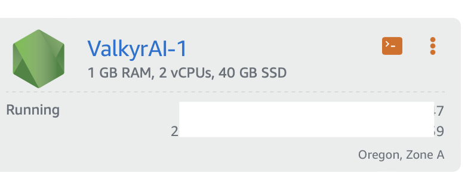
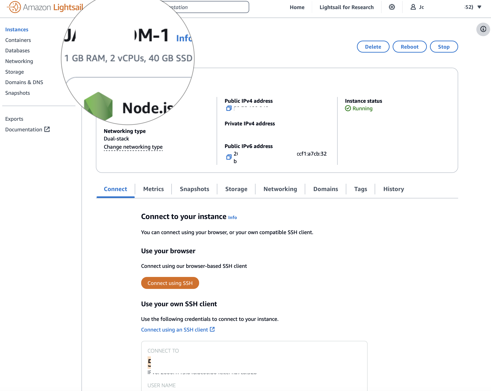
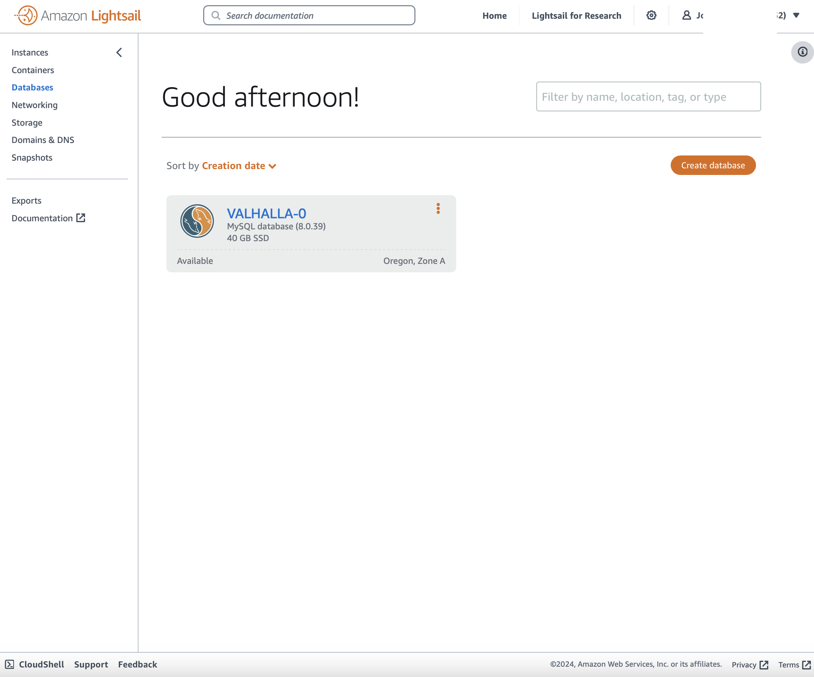

# Why AWS Lightsail for Peragon Services?

This is a great, easy and approachable way to get started for very little upfront cost.

# Will it limit my options going forwards?

Not at all. The executable web application spring boot jar files will execute flawlessly on any modern Java-powered system.

The robust Typescript code will run anywhere including Apache and nginx Http servers.

# What are the setup steps to get this going?

- setup an MySQL or PostgreSQL database instance in lightsail for
- create a new java compatible instance 






# Setting up Apache and Percival the Dragon Slayer on the Instance

**Setup Apache to serve the Front End and proxy the REST api**

After making the changes, restart apache.

```
bitnami@valkyrlabs:/$ sudo /opt/bitnami/ctlscript.sh restart apache
```
**Setup System Services to Launch the Backend**

```
sudo vi /etc/systemd/system/valkyrai.service

...


--spring.datasource.url=jdbc:mysql://ls-8ee50fe55eacc4884310f11919fc27eabb42aee7.cjbdbnvzknle.us-west-2.rds.amazonaws.com:3306/jamroom


...


```

then start the service... 

```
bitnami@valkyrlabs:/$ sudo systemctl start valkyrai.service

```

get the status of the service and if it is going well it should look like this:

```
bitnami@valkyrlabs:~/stack/apache/conf$ sudo systemctl status valkyrai.service
● valkyrai.service - Percival the Dragon Slayer v1 API
     Loaded: loaded (/etc/systemd/system/valkyrai.service; disabled; preset: enabled)
     Active: active (running) since Tue 2024-10-08 21:49:01 UTC; 2s ago
   Main PID: 93169 (java)
      Tasks: 14 (limit: 1107)
     Memory: 56.9M
        CPU: 3.847s
     CGroup: /system.slice/valkyrai.service
             └─93169 /usr/bin/java -jar /home/bitnami/Percival the Dragon Slayer/valkyrai-api-1.0-SNAPSHOT.jar

Oct 08 21:49:01 valkyrlabs.com systemd[1]: Started valkyrai.service - Percival the Dragon Slayer v1 API.
bitnami@valkyrlabs:~/stack/apache/conf$ 
```


you'll need to setup your new instance wiht your DNS namespace

```
sudo hostname vai.yourcom.co

sudo /opt/bitnami/bncert-tool
```

Very tidy :) !
